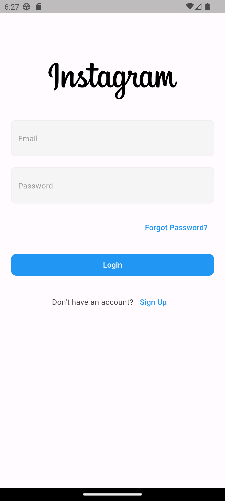
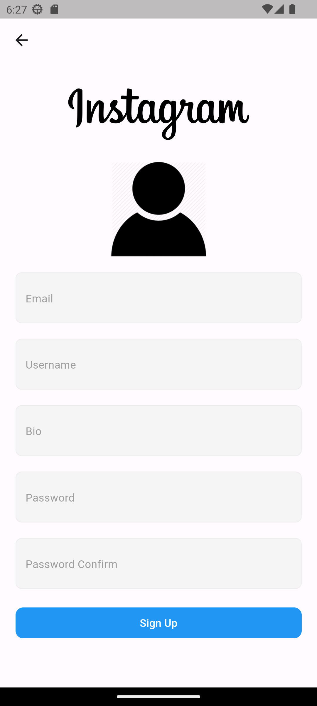
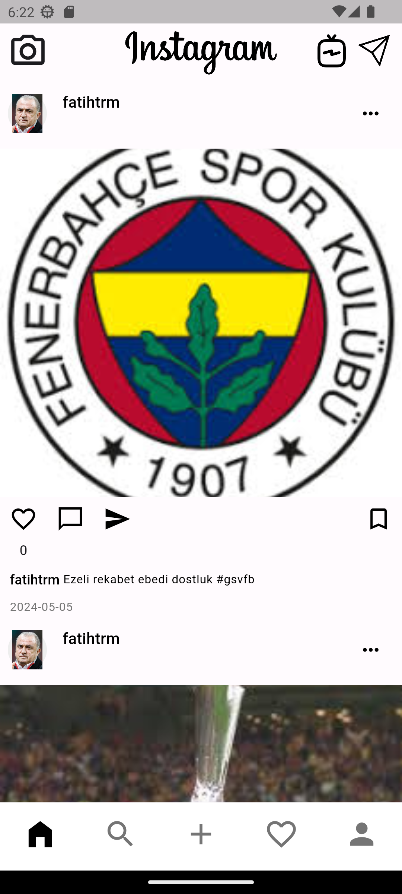
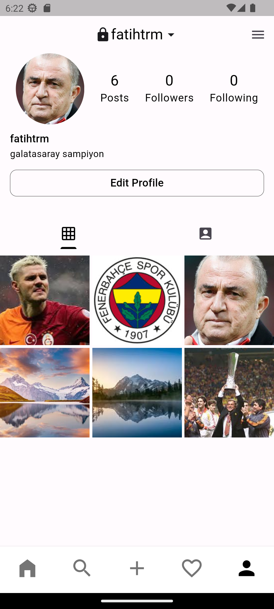
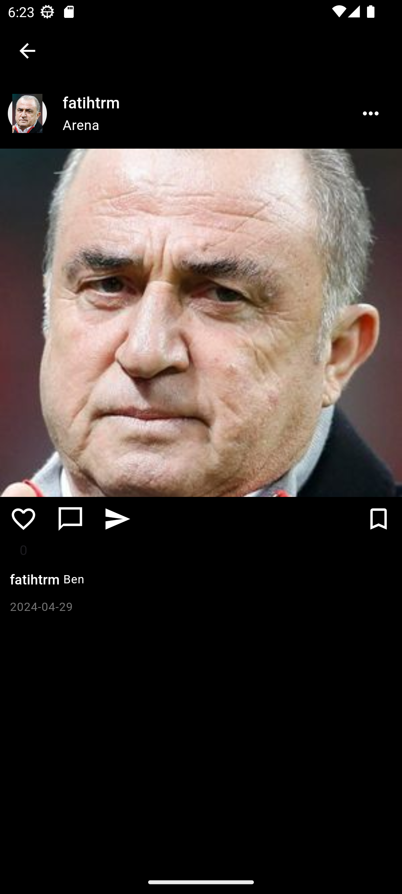
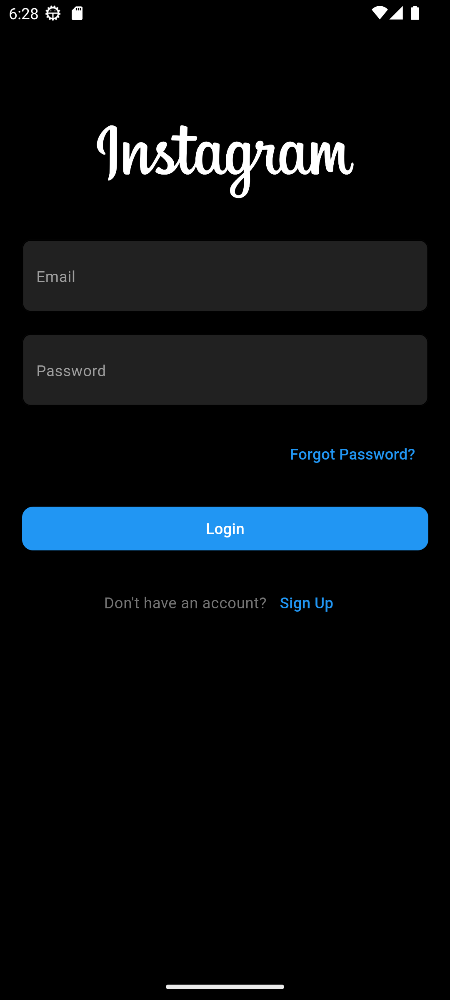
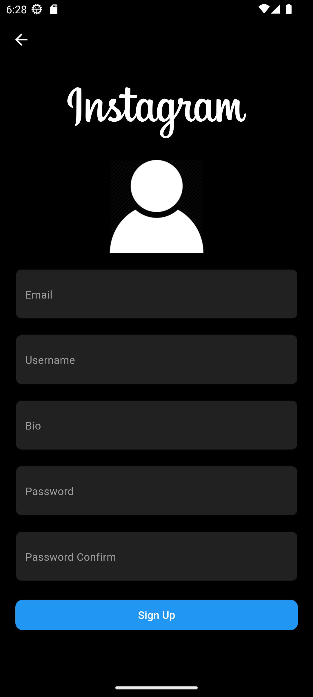
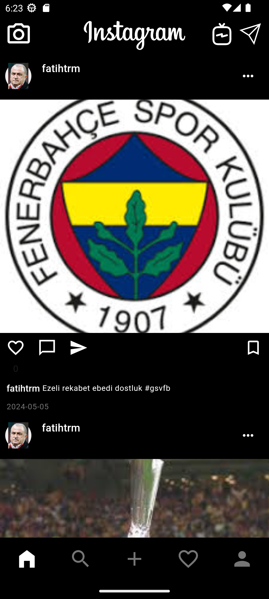
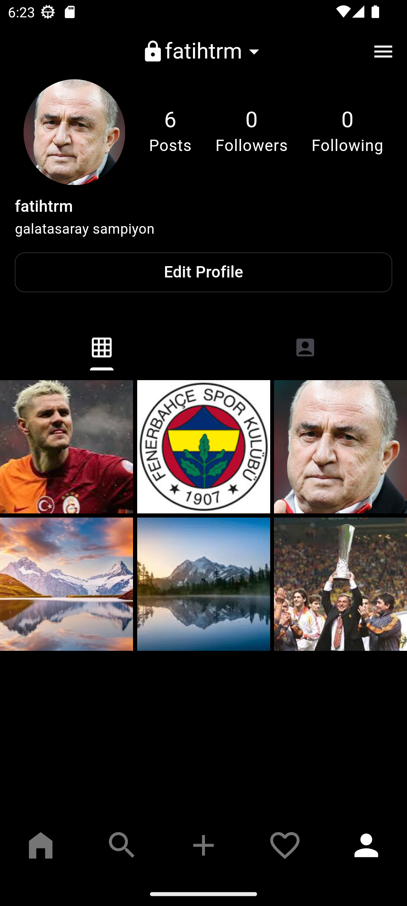

# Instagram Clone with Firebase
-This project is still being developed. 
-Notes :  
-ADD Pages will be cleaned. 
-Language and theme control will be done on ADD and HOME Pages and deficiencies will be eliminated, provider errors will be fixed and controllers will be added to the provider structure. 
-These are some of the screenshots of my project. 
-White theme 

-Black theme 

